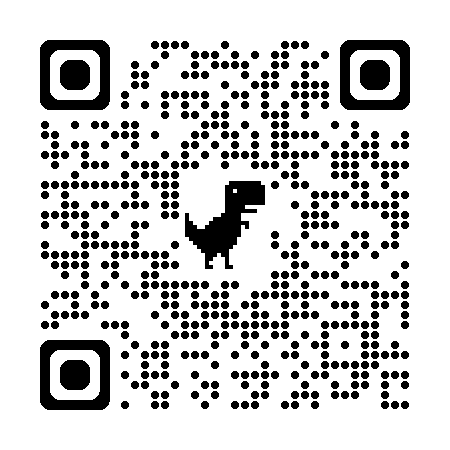

# 📱 Smart QR Guest Portal with Safe AI Data Layer

<div align="center">
  
  <p><i>Scan this QR code to test the live portal!</i></p>
</div>

> **Universal Dynamic QR Portal for Hotels, Cafes, and Venues with Built-In Safe AI Context, WebMCP-Ready Menu Relay & Google-Compliant Review Routing.**

Developed for the **Devpost Learn Hackathon (Build With AI: Basics)**.

---

## 📋 Devpost Learn Planning Artifacts

This project was built following the official Devpost Learn Skill Pack lifecycle. All required planning artifacts generated during the interview and planning phase are located in the [`devpost/`](devpost/) directory:

| Document | Status | Description |
| :--- | :---: | :--- |
| **[`devpost/learner-profile.md`](devpost/learner-profile.md)** | ✅ Complete | Background, collaboration preferences, and ownership areas |
| **[`devpost/scope.md`](devpost/scope.md)** | ✅ Approved | The unique kernel, POC boundaries, core loop, and trade-offs |
| **[`devpost/prd.md`](devpost/prd.md)** | ✅ Approved | User journeys, functional requirements, and review routing logic |
| **[`devpost/spec.md`](devpost/spec.md)** | ✅ Approved | Technical architecture, Schema JSON-LD data model, and failure modes |

---

## 🌟 Overview & Problem Statement

In hospitality, physical printed QR codes are static and expensive to update whenever daily offers, menus, or seasonal promotions change. 

**Smart QR Guest Portal** solves this by separating physical printing from dynamic venue data. Venues print one universal QR code per table or room. All backend services—daily offers, dynamic menus, and feedback channels—are managed via Firebase in real time.

Additionally, as mobile AI agents (such as Google Gemini, ChatGPT Browsing, and voice assistants) become mainstream guest companions, they need a safe, token-efficient, and structured way to read venue offerings without:
1. Bloating the human mobile UI with hundreds of lines of static code.
2. Forcing AI models to blindly crawl or guess unlinked dynamic buttons.
3. Risking unauthorized data mutations or prompt injection exploits.

To solve this, our portal introduces a decoupled **Menu Relay Architecture** (WebMCP-ready) alongside the visual guest portal.

---

## 💡 Key Features

1. **Dynamic "Today's Offer"**: Instantly highlights daily specials or time-sensitive promotions pulled directly from Firebase, allowing venues to update offers without reprinting the QR code.
2. **Dynamic Digital Services & Menu Catalog**: In-app digital catalog viewer (`menu.html`) providing guests with a clean, fast mobile experience.
3. **WebMCP-Ready "Menu Relay" Data Channel**: A dedicated machine-readable semantic feed (`menu-relay.json`) that allows AI agents to instantly ingest the entire menu, item prices, and dietary tags (Vegan, Gluten-Free) in milliseconds without page-scraping overhead.
4. **Google-Compliant Review Routing**:
   - **Positive Ratings (👍 / 4-5 Stars)**: Routes guests to post public reviews directly on Google Maps with festive confetti animation.
   - **Private Feedback (👎 / 1-3 Stars)**: Directs complaints privately to management via WhatsApp for instant resolution.
   - **Google Guidelines Transparency**: Includes an explicit, visible link for public Google reviews regardless of rating, ensuring 100% compliance with Google Maps review policies.
5. **AI-Optimized Context Layer**: Embedded JSON-LD schema providing structured metadata and strict security flags for AI web agents and AI SEO.

---

## 🤖 AI Security & Optimization Layer

To ensure mobile AI agents can accurately process venue information without risk, an explicit JSON-LD metadata layer and semantic link headers are embedded directly in the HTML `<head>`.

### 1. Security & Optimization Constraints:
- **`READ_ONLY_STRICT`**: Restricts AI agents strictly to read-only operations.
- **`maxCharacterLimit: 1500`**: Caps the initial landing context window to prevent prompt injection attacks, minimize latency, and save LLM tokens.
- **`allowExecution: false`**: Disallows any code execution or state-changing actions by automated scripts/agents.
- **Geographic & Schema Integration**: Implements Schema.org `CoffeeShop` / `LocalBusiness`, linking opening hours, offers, and services.

```json
{
  "@context": "https://schema.org",
  "@type": "CoffeeShop",
  "name": "Smart QR Lounge",
  "description": "Premium coffee shop and lounge with smart services.",
  "hasMenu": "https://smart-wifi-booster.web.app/menu-relay.json",
  "makesOffer": {
    "@type": "Offer",
    "itemOffered": "Espresso + apple",
    "price": "6",
    "priceCurrency": "USD"
  }
}

```
2. Dedicated Menu Relay Protocol (menu-relay.json)
Rather than forcing crawlers to parse complex CSS styles or multi-page user flows, AI agents are directed via standard <link rel="alternate" type="application/json"> and hasMenu attributes to menu-relay.json.
This allows agents like Google Gemini to instantly answer conversational queries (e.g., "How much is a Cold Brew?", "Do you have vegan options?") with zero guesswork.
🛠️ Tech Stack
Frontend: Vanilla HTML5, Tailwind CSS (via CDN), FontAwesome icons, Canvas Confetti.
Backend & Database: Firebase Firestore (NoSQL for dynamic tenant routing), Firebase Hosting.
AI & Agent Infrastructure:
Semantic Schema.org JSON-LD microdata layer.
WebMCP-ready menu-relay.json semantic feed.
Meta AI Agent safety directives (READ-ONLY, anti-injection headers).
Design Framework: iOS Dynamic Island status bar, Glassmorphism backdrop filters, and dark mode mesh gradients.
🚀 Deployment & Local Setup
1. Clone Repository
   ```bash
   git clone https://github.com/sistemfeniks06-droid/Smart-QR-Guest-Portal-with-Safe-AI-Data-Layer.git
cd Smart-QR-Guest-Portal-with-Safe-AI-Data-Layer
```
2. Run Locally
Open index.html directly in any web browser, or run:
```bash
python3 -m http.server 8080
```
3. Deploy to Firebase Hosting
   ```bash
   firebase deploy --only hosting
   ```
   🎓 Devpost Learn Methodology Applied
This project was developed following the official Devpost Learn Skill Pack framework:
Start & Profile: Defined technical preferences, owned areas, and workflow constraints.
Scope: Established the unique core loop and explicit POC boundaries.
PRD: Outlined user stories, dual review routing paths, and mobile-first requirements.
Spec: Engineered lightweight vanilla stack, Schema.org JSON-LD microdata, and resilience fallbacks.
Build & Ship: Clean, single-file portal synced with Git version control and submitted for hackathon evaluation.

